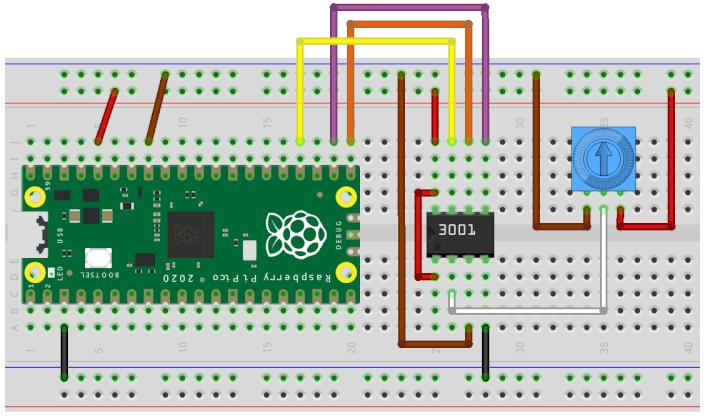

# micropython-MCP3001

MicroPython library for the MCP3001 10-bit 1-channel SPI
Analogue-Digital converter

This library enables an MCP3001 ADC to be used with any MicroPython
implementation that supports SPI. Almost all MicroPython-capable
boards have adequate ADCs onboard, so you might only want to use this
library if:

* your board has no ADC (like the Wemos
  [W600-PICO](https://www.wemos.cc/en/latest/w600/w600_pico.html#w600-pico))
  or a very limited one (as on the ESP8266); or
  
* you wish to use an external reference voltage source such as an
  LM4040.
  
## Installation

Copy the `mcp3001.py` file to your MicroPython board's filesystem,
typically to the root or `/lib` folder.

## Usage

```python3
import mcp3001
# …
adc = mcp3001.MCP3001(spi, cs)
```

### Initialization

```
MCP3001(spi, cs [, ref_voltage])
```

* `spi` is an instance of a [Serial Peripheral Interface
  bus](https://docs.micropython.org/en/latest/library/machine.SPI.html)
  object, for example `spi = machine.SPI(0)`
  
* `cs` is an instance of an [I/O
  pin](https://docs.micropython.org/en/latest/library/machine.Pin.html)
  object, configured for output and ideally initially set high. An
  example might be `cs = machine.Pin(17, machine.Pin.OUT, value=1)`
  
* `ref_voltage` is an optional argument to manually set the
  reference voltage. If it is not specified as a float, the value of
  3.3 is assumed.
  
### Methods

* `read()` — returns an integer ADC reading from 0–1023.

* `read_u16()` — returns an integer ADC reading from 0—65535. This
  is provided for compatibility with MicroPython's
  [method of the same name](https://docs.micropython.org/en/latest/library/machine.ADC.html#machine.ADC.read_u16).
  
* `read_v()` — returns a floating-point ADC reading from
  0.0 – *reference voltage* volts.
  
* `reference_voltage()` — returns the ADC reference voltage as a
  floating-point value. Returns 3.3 if none was given during
  initialization.

## Example

An MCP3001 is used to read the value of a potentiometer into a
Raspberry Pi Pico. The brown wires in the diagram indicate analogue
ground, and have been kept separate from the black system ground
wires. If your board doesn't have a separate **AGND** connection, a
regular **GND** connection will do.

The default `SPI(0)` pins have been used on the Raspberry Pi Pico:
GP16 for RX, GP17 for CSn and GP18 for SCK. In the absence of an
external reference voltage, **3V3(OUT)** has been connected to
**V<sub>REF</sub>** on the MCP3001.



Code: [test_mcp3001.py](test_mcp3001.py)

## Device information

Datasheet: [MicroChip MCP3001 2.7V 10-Bit A/D Converter with SPI™
Serial
Interface](https://ww1.microchip.com/downloads/aemDocuments/documents/APID/ProductDocuments/DataSheets/21293C.pdf)

### Pinout

1. **V<sub>REF</sub>** — analogue reference voltage. Should not exceed
   **V<sub>DD</sub>**.

2. **IN+** — Positive analogue input. While **IN+** and **IN-** form a
   pseudo-differential pair, they can't float completely unrelated to
   system voltages. Please refer to the datasheet.

3. **IN-** — Negative analogue input. Typically connected to
   **V<sub>SS</sub>**, or analogue ground (**AGND**) if your
   micro-controller has it.

4. **V<sub>SS</sub>** — Ground.

5. **<span style="text-decoration: overline;">CS</span>/SHDN** — SPI
   Chip Select (active low) and combined ADC shutdown line.

6. **D<sub>OUT</sub>** — SPI serial data out.

7. **CLK** — SPI serial data clock.

8. **V<sub>DD</sub>** — power supply, 2.7–5.5 V DC.

Note that the MCP3001, unlike other chips in the MCP300x range, has no
SPI **D<sub>IN</sub>** pin. Its entire operation is controlled by the
**<span style="text-decoration: overline;">CS</span>/SHDN** pin, and
only the data out and clock lines are used.

## Credits

© Stewart Russell — scruss.com, 2024.

Based on Romilly Cocking's
[mcp3008.py](https://github.com/romilly/pico-code/blob/master/src/pico_code/pico/mcp3008/mcp3008.py)
library.
